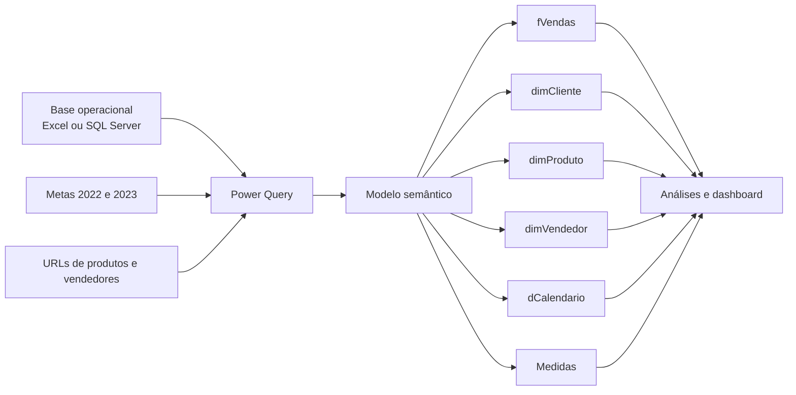

# Dashboard Comercial — Power BI

> Projeto de portfólio em desenvolvimento, criado a partir de um business case educacional da Xperiun/Data Expert.

**Status atual:** modelo semântico iniciado; camada visual ainda não concluída.

## Visão geral

Este projeto tem como objetivo transformar dados comerciais em uma solução analítica para acompanhamento de vendas, metas e desempenho da estrutura comercial.

A base do desafio reúne pedidos, itens vendidos, clientes, produtos, vendedores, supervisores, gerentes, regiões e metas comerciais. O desenvolvimento utiliza Power BI, Power Query e uma organização dimensional voltada à análise por tempo, produto, cliente e equipe de vendas.

O arquivo autoral atual é `PROJETO 31 - Comercial.pbix`. O material de solução e os assets visuais fornecidos com o curso não são redistribuídos neste repositório: eles permanecem apenas no ambiente local e estão listados no `.gitignore`.

## Objetivos de negócio

- acompanhar o realizado e compará-lo com as metas comerciais;
- analisar a evolução das vendas ao longo do tempo;
- identificar diferenças de desempenho entre categorias e produtos;
- avaliar resultados por gerente, supervisor e vendedor;
- explorar a distribuição dos clientes por cidade, estado e região;
- apoiar recomendações comerciais com base em evidências.

Esses itens representam o escopo analítico previsto. A camada visual do arquivo autoral ainda precisa ser construída e validada antes que o projeto seja apresentado como concluído.

## Perfil dos dados

| Fonte | Conteúdo confirmado |
|---|---|
| `BaseDadosOLTP.xlsx` | 10 tabelas operacionais, incluindo 3.431 vendas e 39.960 itens de venda |
| `Meta_2022.csv` | 96 registros de metas mensais por gerente e categoria |
| `Meta_2023.xlsx` | metas de dois gerentes, organizadas por quatro categorias e quatro colunas de distribuição |
| `PinskiDatabase_Fotos.xlsx` | 25 URLs de produtos e 12 URLs de vendedores |
| `PinskiDatabase.bak` | backup do banco SQL Server fornecido com o desafio |
| `Script Views.txt` | views de cliente, produto, vendedor e vendas |
| `dCalendario.txt` | consulta Power Query para geração do calendário |

O histórico transacional disponível vai de **16/02/2021 a 22/10/2023**.

### Dimensões de análise disponíveis

- 701 clientes;
- 93 registros de produto, correspondentes a 25 descrições e quatro categorias;
- 12 vendedores;
- cinco supervisores;
- dois gerentes;
- 23 cidades distribuídas por 17 UFs;
- calendário derivado do período das vendas.

## Qualidade e limitações dos dados

### Validações concluídas

- não foram encontrados registros órfãos nas chaves verificadas entre vendas, itens, clientes, produtos, vendedores, supervisores, geografias e fotos;
- os 39.960 itens respeitam a regra `quantidade × valor unitário = valor bruto`;
- o valor bruto das vendas concilia com a soma dos itens;
- a regra `valor bruto − desconto = valor de venda` concilia em todas as 3.431 vendas;
- não foram encontrados IDs duplicados em vendas, itens, clientes ou notas fiscais.

### Pontos de atenção

- existem 10 ocorrências de nomes de cliente repetidos; análises e relacionamentos devem utilizar o ID do cliente, não a descrição;
- cinco clientes e três registros de produto não possuem venda no período, o que pode ser válido, mas deve ser considerado nas análises de cobertura;
- o desconto está registrado no nível da venda e precisa de uma regra explícita de rateio para análises líquidas por produto ou categoria;
- o custo do produto não possui data de vigência; por isso, qualquer cálculo histórico de margem baseado no custo atual deve ser identificado como estimativa.

## Arquitetura analítica



As seis tabelas exibidas no diagrama do PBIX autoral são `fVendas`, `dimCliente`, `dimProduto`, `dimVendedor`, `dCalendario` e `Medidas`. Os relacionamentos e as definições das medidas deverão ser documentados após a validação final do modelo.

## Tecnologias e recursos

- Microsoft Power BI Desktop;
- Power Query (linguagem M);
- SQL Server, Excel e CSV como fontes do desafio;
- organização dimensional para análise comercial.

## Estrutura do projeto

```text
.
├── PROJETO 31 - Comercial.pbix       # arquivo autoral em desenvolvimento
├── Desafio/
│   ├── Bases de Dados/               # dados e scripts fornecidos no desafio
│   └── Metodologia ESI/              # referência metodológica
├── docs/
│   ├── RELATORIO-MEDIDAS-DAX.md      # inventário e auditoria das medidas do modelo
│   └── PUBLICACAO-LINKEDIN.md        # texto e checklist para divulgação
└── README.md
```

## Como abrir o projeto

1. Instale uma versão atual do Power BI Desktop.
2. Faça o download ou clone deste projeto.
3. Abra `PROJETO 31 - Comercial.pbix`.
4. Caso o Power BI solicite novos caminhos ou credenciais, remapeie as fontes na configuração da fonte de dados.
5. Atualize as consultas e valide o modelo antes de utilizar qualquer indicador.

## Divulgação

O arquivo [PUBLICACAO-LINKEDIN.md](docs/PUBLICACAO-LINKEDIN.md) contém uma versão de post adequada ao estágio atual e outra versão para ser completada depois da validação final do dashboard.

## Andamento

| Etapa | Situação | Evidência atual |
|---|---|---|
| Fontes e estrutura do desafio | Concluída | arquivos Excel, CSV, SQL e Power Query disponíveis |
| Modelo semântico | Em desenvolvimento | seis tabelas identificadas no diagrama do PBIX |
| Relacionamentos e medidas | Pendente de documentação | ainda não validados para publicação |
| Páginas e visuais | Pendente | PBIX autoral possui uma página sem visuais registrados |
| Testes dos indicadores | Pendente | dependem da conclusão das medidas e dos visuais |
| Capturas para o portfólio | Pendente | devem ser geradas após a validação do dashboard |

## Próximos passos

- validar os relacionamentos do modelo e a direção dos filtros;
- revisar e documentar todas as medidas da tabela `Medidas`;
- construir a análise de realizado versus meta;
- desenvolver as páginas de detalhamento comercial;
- validar números, filtros e interações em diferentes contextos;
- exportar capturas em alta resolução para o GitHub e o LinkedIn;
- substituir este status por “concluído” somente após a validação funcional.

## Publicação responsável

Antes de tornar o repositório público:

- confirme se as bases e o backup `.bak` do desafio podem ser redistribuídos;
- mantenha fora do repositório a solução de referência e os assets do curso, e nunca os apresente como trabalho autoral;
- remova credenciais, caminhos locais e dados que não tenham autorização de publicação;
- defina uma licença apenas para o conteúdo de sua autoria;
- inclua pelo menos uma captura do dashboard autoral concluído;
- mantenha no README a atribuição ao business case original.

## Créditos

Projeto de estudo baseado em material da [Xperiun](https://xperiun.com/) e na referência de [Metodologia ESI](https://xperiun.notion.site/Metodologia-ESI-150f529a571a468895791b084109cf84?pvs=74) disponibilizada com o desafio.

O modelo, as análises, as medidas e o design que vierem a compor o arquivo `PROJETO 31 - Comercial.pbix` devem ser identificados como desenvolvimento autoral somente depois de concluídos e validados.
